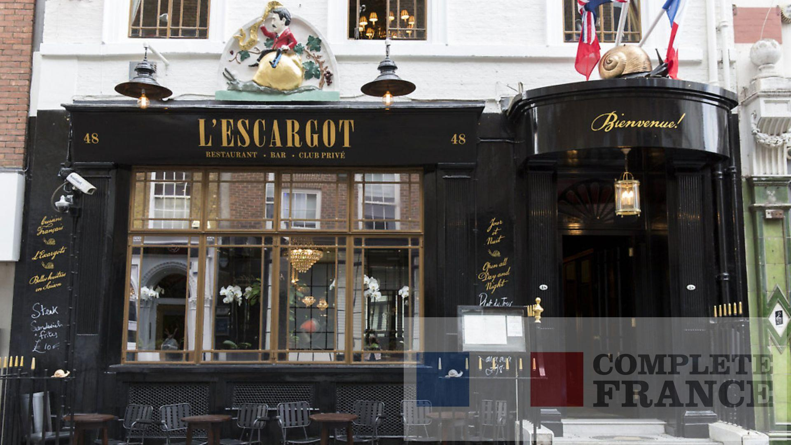
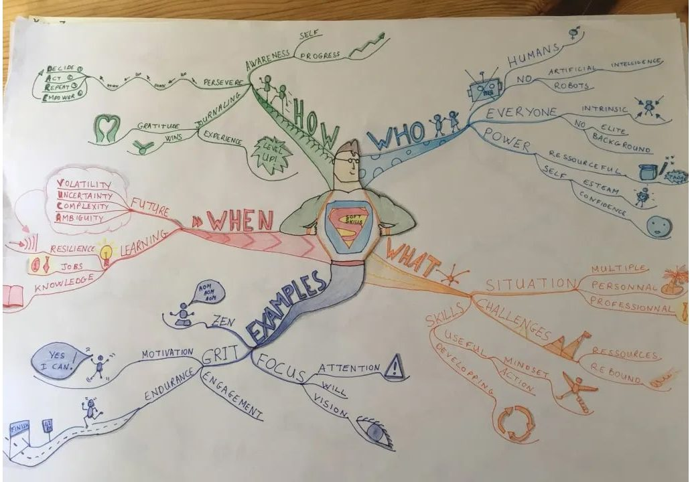

📅 06 juin 2019

📍Restaurant l’Escargot, Soho, Londres

J’étais à Londres, la semaine dernière pour le championnat de lecture rapide et de mind-mapping.

Je ne parlerais pas ici de ce qu'est la lecture rapide et le mind-mapping.

Pour la lecture rapide, c’est assez simple à deviner.

Le mind-mapping, un peu moins.

Ça fera peut-être l’objet d'un prochain article.

Je vais juste partager mon expérience de cette semaine passée outre-Manche.

Nous étions 7 personnes de 5 nationalités différentes.

🇨🇳 🇵🇰 🇵🇱 🇮🇹 🇫🇷
-----------

La journée est coupée en deux.

La lecture rapide le matin et le mind-mapping l’après-midi.

Le délibérer se fait en fin de journée avec remise des prix et médailles.

***

Nous devions lire un livre, de plus de 200 pages, le plus rapidement possible et répondre à une vingtaine de questions.

Les juges comptabilisent d’abord le nombre de réponses correct avant de s’attaquer au temps mis pour finir le livre.

Si A lit un livre de 200 pages en 1 heure et ne répond à aucune question et B lit un livre de 200 pages en 15 heures et répond correctement à une question.

B gagne sur A.

J’ai volontairement exagérer le temps mis par B pour finir son livre, pour souligner, que la compréhension est le paramètre le plus important en lecture rapide.

L’après-midi, on s’attaque au mind-maping.

La première sous-épreuve est de schématiser, sous-forme de mind-map, une conversation de quelques minutes entre deux personnes.

La deuxième sous-épreuve, dite *freestyle* laisse libre cours à nos envies. On doit réaliser un mind-map sur le sujet de notre choix.

La journée de travail est finie et on attend les résultats.

Les juges arrivent...

🥁🥁🥁
-----------

***
Je n’ai pas gagné cette année.

Un Français à remporter la première place du mind-mapping.

*Mind-map de [Jérôme Hoarau](https://jerome-hoarau.com "Site officiel de Jérôme Hoarau") , vainqueur en 2019*

Une Pakistanaise a gagné la première place de la lecture-rapide.

C’était du très très haut niveau.

Mais voici pour moi,  le point le plus important de cette journée.

J’ai gagné autre chose.

J’ai rencontré, discuté et rigolé avec des personnes intéréssantes et intelligentes.

Et pour les rencontrer faut aller là où elles se trouvent.

J’ai été vraiment honoré que l’on passe cette journée ensemble et que l'on serve une vision commune de ce qu'est la compétition, le travail, la tolérance et le partage.

