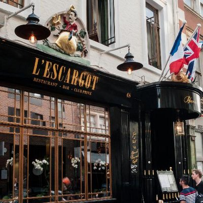

📅 06 juin 2019

📍Restaurant l’Escargot, Soho, Londres

J’étais à Londres, la semaine dernière pour le championnat de lecture rapide et de mind-mapping de Grande-Bretagne.

Dans cet article, je n'éxpliquerais pas ce qu'est la lecture rapide et le mind-mapping.

Ça fera peut-être l’objet d'un prochain post.

Je vais juste partager mon expérience de cette semaine passée outre-Manche.

Nous étions 7 personnes de 5 nationalités différentes.

🇨🇳 🇵🇰 🇵🇱 🇮🇹 🇫🇷
-----------
La journée est coupée en deux.

La lecture rapide le matin et le mind-mapping l’après-midi.

Le délibérer se fait en fin de journée avec remise des prix et médailles.

<h2>Le championnat</h2>

Nous devions lire un livre (<i>en anglais</i>), de plus de 200 pages, le plus rapidement possible et répondre à une vingtaine de questions.

Les juges comptabilisent d’abord le nombre de réponses correct avant de prendre en compte le temps mis pour finir le livre.

Si A lit <b>un livre de 200 pages en 1 heure et ne répond à aucune question</b> et B lit <b>un livre de 200 pages en 15 heures et répond correctement à une question,</b>

B gagne sur A.

J’ai volontairement exagéré le temps mis par B pour finir son livre, pour souligner, que la compréhension est le paramètre le plus important en lecture rapide.

L’après-midi, on s’attaque au mind-maping.

La première sous-épreuve est de schématiser, sous-forme de mind-map, une conversation de quelques minutes entre deux personnes.

La deuxième sous-épreuve, *freestyle*, laisse libre cours à nos envies. On doit réaliser un mind-map sur le sujet de notre choix.

La journée de travail est finie et on attend les résultats.

Les juges arrivent...

🥁🥁🥁
-----------

Je n’ai pas gagné cette année.

Un Français à remporter la première place du mind-mapping.

*Mind-map de [Jérôme Hoarau](https://jerome-hoarau.com "Site officiel de Jérôme Hoarau") , vainqueur en 2019*

Une participante de la délégation pakistanaise a gagné la première place de la lecture-rapide.

C’était du très très haut niveau.

<h2>Note finale</h2>

Mais voici pour moi, le point le plus important de cette journée.

J’ai gagné autre chose.

J’ai rencontré, discuté et rigolé avec des personnes intéressantes et intelligentes.

C'est important de bien s'entourer.

C'était l'endroit idéal pour cela.

J’ai été vraiment honoré que l’on passe cette journée ensemble et que l'on serve une vision commune de ce qu'est la compétition, le travail, la tolérance et le partage.